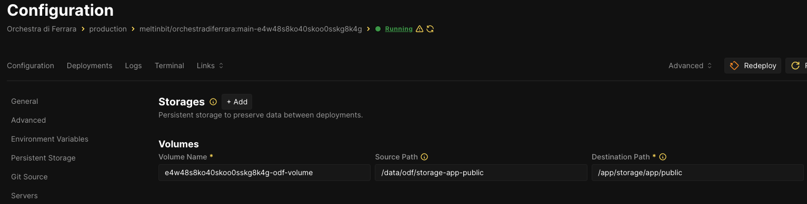
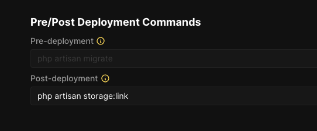

# Laravel Starter Kit

This is a Laravel starter kit that provides a solid foundation for building web applications with Laravel, Inertia.js, and TypeScript.

## Requirements

- PHP 8.1 or higher
- Composer
- Node.js 16+ and npm
- SQLite (or your preferred database)

## Local Development Setup

1. Clone the repository:

    ```bash
    git clone https://github.com/meltinbit/laravel-starter-kit-25.git my-new-app-name
    cd laravel-starter-kit-25
    ```

2. Install PHP dependencies:

    ```bash
    composer install
    ```

3. Set up your environment file:

    ```bash
    cp .env.example .env
    ```

4. Generate application key:

    ```bash
    php artisan key:generate
    ```

5. Install Node.js dependencies:

    ```bash
    npm install
    ```

6. Initialize the database:

    ```bash
    php artisan migrate
    ```

7. Start the development server:
    ```bash
    composer run dev
    ```

This will start both the Laravel development server and Vite for asset compilation. Your application will be available at [http://localhost:8000](http://localhost:8000).

## Available Commands

- `composer run dev`: Start the development server and asset compilation
- `composer run build`: Build production assets
- `php artisan test`: Run the test suite
- `php artisan migrate:fresh --seed`: Reset and seed the database

## Features

- Laravel 10.x
- Inertia.js with TypeScript support
- Tailwind CSS for styling
- Laravel Fortify for authentication
- TypeScript support
- SQLite database (easily configurable for other databases)
- Testing setup with Pest PHP

## Directory Structure

Key directories in the project:

- `app/`: Contains the core code of your application
- `resources/`: Contains views, raw assets, and client-side code
- `routes/`: Contains all route definitions
- `tests/`: Contains test cases
- `database/`: Contains database migrations and seeders

### Deployment on Coolify

Need the nixpacks.toml file

```
[phases.setup]
nixPkgs = ["...", "python311Packages.supervisor"]

[phases.build]
cmds = [
    "mkdir -p /etc/supervisor/conf.d/",
    "cp /assets/worker-*.conf /etc/supervisor/conf.d/",
    "cp /assets/supervisord.conf /etc/supervisord.conf",
    "chmod +x /assets/start.sh",
    "..."
]

[start]
cmd = '/assets/start.sh'

[staticAssets]
"start.sh" = '''
#!/bin/bash

# Transform the nginx configuration
node /assets/scripts/prestart.mjs /assets/nginx.template.conf /etc/nginx.conf

# Start supervisor
supervisord -c /etc/supervisord.conf -n
'''

"supervisord.conf" = '''
[unix_http_server]
file=/assets/supervisor.sock

[supervisord]
logfile=/var/log/supervisord.log
logfile_maxbytes=50MB
logfile_backups=10
loglevel=info
pidfile=/assets/supervisord.pid
nodaemon=false
silent=false
minfds=1024
minprocs=200

[rpcinterface:supervisor]
supervisor.rpcinterface_factory = supervisor.rpcinterface:make_main_rpcinterface

[supervisorctl]
serverurl=unix:///assets/supervisor.sock

[include]
files = /etc/supervisor/conf.d/*.conf
'''

"worker-nginx.conf" = '''
[program:worker-nginx]
process_name=%(program_name)s_%(process_num)02d
command=nginx -c /etc/nginx.conf
autostart=true
autorestart=true
stdout_logfile=/var/log/worker-nginx.log
stderr_logfile=/var/log/worker-nginx.log
'''

"worker-phpfpm.conf" = '''
[program:worker-phpfpm]
process_name=%(program_name)s_%(process_num)02d
command=php-fpm -y /assets/php-fpm.conf -F
autostart=true
autorestart=true
stdout_logfile=/var/log/worker-phpfpm.log
stderr_logfile=/var/log/worker-phpfpm.log
'''

"worker-laravel.conf" = '''
[program:worker-laravel]
process_name=%(program_name)s_%(process_num)02d
command=bash -c 'exec php /app/artisan queue:work --sleep=3 --tries=3 --max-time=3600'
autostart=true
autorestart=true
stopasgroup=true
killasgroup=true
numprocs=12 # To reduce memory/CPU usage, change to 2.
startsecs=0
stopwaitsecs=3600
stdout_logfile=/var/log/worker-laravel.log
stderr_logfile=/var/log/worker-laravel.log
'''

"php-fpm.conf" = '''
[www]
listen = 127.0.0.1:9000
user = www-data
group = www-data
listen.owner = www-data
listen.group = www-data
pm = dynamic
pm.max_children = 50
pm.min_spare_servers = 4
pm.max_spare_servers = 32
pm.start_servers = 18
clear_env = no
php_admin_value[post_max_size] = 35M
php_admin_value[upload_max_filesize] = 30M
'''

"nginx.template.conf" = '''
user www-data www-data;
worker_processes 5;
daemon off;

worker_rlimit_nofile 8192;

events {
  worker_connections  4096;  # Default: 1024
}

http {
    include    $!{nginx}/conf/mime.types;
    index    index.html index.htm index.php;

    default_type application/octet-stream;
    log_format   main '$remote_addr - $remote_user [$time_local]  $status '
        '"$request" $body_bytes_sent "$http_referer" '
        '"$http_user_agent" "$http_x_forwarded_for"';
    access_log /var/log/nginx-access.log;
    error_log /var/log/nginx-error.log;
    sendfile     on;
    tcp_nopush   on;
    server_names_hash_bucket_size 128; # this seems to be required for some vhosts

    server {
        listen ${PORT};
        listen [::]:${PORT};
        server_name localhost;

        $if(NIXPACKS_PHP_ROOT_DIR) (
            root ${NIXPACKS_PHP_ROOT_DIR};
        ) else (
            root /app;
        )

        add_header X-Content-Type-Options "nosniff";

        client_max_body_size 35M;

        index index.php;

        charset utf-8;


        $if(NIXPACKS_PHP_FALLBACK_PATH) (
            location / {
                try_files $uri $uri/ ${NIXPACKS_PHP_FALLBACK_PATH}?$query_string;
            }
        ) else (
          location / {
                try_files $uri $uri/ /index.php?$query_string;
           }
        )

        location = /favicon.ico { access_log off; log_not_found off; }
        location = /robots.txt  { access_log off; log_not_found off; }

        $if(IS_LARAVEL) (
            error_page 404 /index.php;
        ) else ()

        location ~ \.php$ {
            fastcgi_pass 127.0.0.1:9000;
            fastcgi_param SCRIPT_FILENAME $realpath_root$fastcgi_script_name;
            include $!{nginx}/conf/fastcgi_params;
            include $!{nginx}/conf/fastcgi.conf;
        }

        location ~ /\.(?!well-known).* {
            deny all;
        }
    }
}
'''
```

For https insert the domains and set the `APP_URL` correctly pointing to the domain
and `FORCE_HTTPS=true`, `APP_ENV=production`, `APP_DEBUG=false`

In `app/Providers/AppServeiceProvider.php` add

```
use Illuminate\Support\Facades\URL;


public function boot(): void
	{
		if (config('app.env') === 'production') {
			URL::forceScheme('https');
		}
	}
```

For App Name in title bar

```
VITE_APP_NAME="Nome del sito o App"
```

For images create volume


For images to be shown remember from Coolify container terminal to launch

```php artisan storage:link

```

Best to add it in Coolify Configuration as Post-deployment



## Contributing

[Add your contribution guidelines here]

## License

[Add your license information here]
